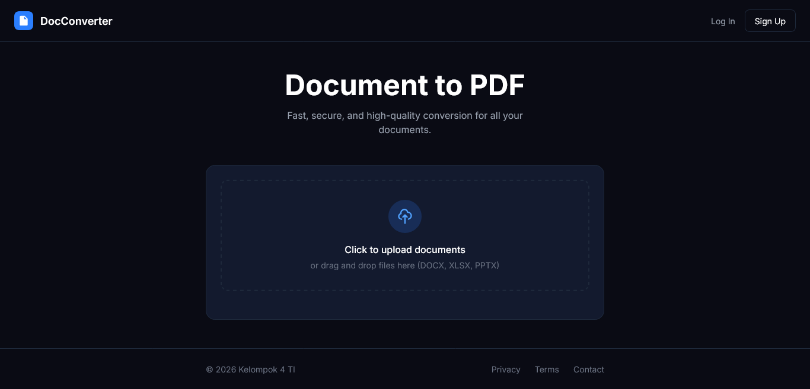

# DocConverter 📄➡️📂


**DocConverter** adalah aplikasi web konversi dokumen modern yang dirancang untuk memudahkan pengguna mengubah format dokumen Office (Word, Excel, PowerPoint) menjadi PDF dengan cepat dan efisien.



Proyek ini dikembangkan sebagai tugas akhir mata kuliah **Pemrograman Frontend** oleh **Kelompok 4 - Teknologi Informasi**.

## ✨ Fitur

- 📤 **Drag & Drop Upload** - Upload file dengan drag & drop atau klik
- 📁 **Multi-file Support** - Konversi banyak file sekaligus
- 📊 **Progress Tracking** - Lihat progress konversi real-time
- 📥 **Batch Download** - Download semua file sebagai ZIP
- 📱 **Responsive Design** - Tampilan optimal di desktop & mobile
- 🌙 **Dark Mode** - Desain modern dengan tema gelap

## 📋 Format yang Didukung

| Input | Output |
|-------|--------|
| Word (.docx, .doc) | PDF |
| Excel (.xlsx, .xls) | PDF |
| PowerPoint (.pptx, .ppt) | PDF |

---

## 🚀 Getting Started

### Prerequisites

- Node.js 18+ 
- npm atau yarn
- API Key dari [ConvertAPI](https://www.convertapi.com)

### Installation

1. **Clone repository**
   ```bash
   https://github.com/bramantyo-source/SimplyPDF.git
   cd SimplyPDF
   ```

2. **Install dependencies**
   ```bash
   npm install
   ```

3. **Setup environment variables**
   
   Buat file `.env.local`:
   ```env
   CONVERT_API_SECRET=your_api_key_here
   ```
   
   > 💡 Dapatkan API key gratis di [convertapi.com](https://www.convertapi.com/a/signup)

4. **Run development server**
   ```bash
   npm run dev
   ```

5. **Buka browser**
   
   Akses [http://localhost:3000](http://localhost:3000)

---

## 📁 Struktur Proyek

```
converter-pdf/
├── app/
│   ├── api/
│   │   ├── convert/      # Endpoint konversi
│   │   └── download/     # Endpoint download
│   ├── globals.css       # Styling global
│   ├── layout.tsx        # Root layout
│   └── page.tsx          # Halaman utama
├── docs/
│   ├── style-guide.md           # Dokumentasi style
│   ├── wireframe-navigation.md  # Wireframe & navigasi
│   └── api-integration.md       # Catatan integrasi API
└── public/
```

---

## 📚 Dokumentasi

| Dokumen | Deskripsi |
|---------|-----------|
| [Style Guide](./docs/style-guide.md) | Warna, tipografi, komponen UI |
| [Wireframe & Navigasi]() | Arsitektur dan alur navigasi |
| [API Integration](./docs/api-integration.md) | Catatan teknis integrasi API |

---

## 🛠️ Tech Stack

| Technology | Version | Purpose |
|------------|---------|---------|
| **Next.js** | 16.1 | React Framework |
| **React** | 19.2 | UI Library |
| **TypeScript** | 5.x | Type Safety |
| **Tailwind CSS** | 4.x | Styling |
| **ConvertAPI** | - | Document Conversion |
| **JSZip** | 3.10 | ZIP Download |

---

## 🔧 Scripts

```bash
npm run dev      # Development server
npm run build    # Production build
npm run start    # Start production server
npm run lint     # Run ESLint
```

---

## 👥 Tim Pengembang

**Kelompok 4**
| Nama | Role | Tanggung Jawab |
| :--- | :--- | :--- |
| **Rafael Bramantyo Buana Putra** | Lead Developer | System Architect, Core Logic, & API Integration |
| **Akhmad Fatih Jalaluddin Rumi** | Presentation Specialist | Penyusunan Materi PPT & Presentator Utama |
| **Alfa** | QA & Tester | Pengujian Sistem (Testing) & Dokumentasi Bug |
| **Syafiq** | Technical Documentarian | Dokumentasi Teknis & Penyusunan Laporan |
---

## 📄 License

MIT License - feel free to use this project for educational purposes.

---

<p align="center">
  Made with by Kelompok 4 TI
</p>
