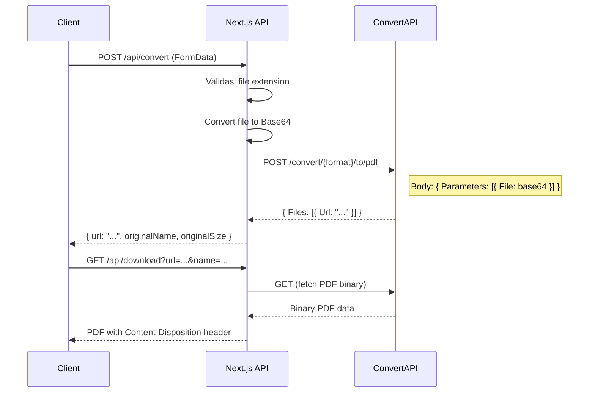

# DocConverter - Catatan Teknis Integrasi API

Dokumentasi teknis tentang integrasi API pada aplikasi DocConverter.

---

## 🌐 API Overview

Aplikasi menggunakan **ConvertAPI** sebagai layanan eksternal untuk konversi dokumen ke PDF.

| Provider | Website | Pricing |
|----------|---------|---------|
| ConvertAPI | [convertapi.com](https://www.convertapi.com) | Free tier: 250 seconds/month |

---

## 📡 API Endpoints

### 1. POST `/api/convert`

Endpoint untuk mengkonversi dokumen ke PDF.

**Request:**
```http
POST /api/convert
Content-Type: multipart/form-data
```

| Field | Type | Required | Description |
|-------|------|----------|-------------|
| file | File | Yes | Dokumen yang akan dikonversi |

**Supported Formats:**
- `.docx`, `.doc` (Microsoft Word)
- `.xlsx`, `.xls` (Microsoft Excel)
- `.pptx`, `.ppt` (Microsoft PowerPoint)

**Response (Success):**
```json
{
  "url": "https://v2.convertapi.com/d/xxxxxxxx/document.pdf",
  "originalName": "document.docx",
  "originalSize": 25600
}
```

**Response (Error):**
```json
{
  "error": "Format file tidak didukung"
}
```

**Status Codes:**
| Code | Description |
|------|-------------|
| 200 | Konversi berhasil |
| 400 | File tidak valid / format tidak didukung |
| 500 | Error server / API key tidak dikonfigurasi |

---

### 2. GET `/api/download`

Proxy endpoint untuk download PDF dengan nama file yang benar.

**Request:**
```http
GET /api/download?url={pdfUrl}&name={filename}
```

| Parameter | Type | Required | Description |
|-----------|------|----------|-------------|
| url | string | Yes | URL PDF dari ConvertAPI |
| name | string | No | Nama file untuk download (default: document.pdf) |

**Response:**
```http
Content-Type: application/pdf
Content-Disposition: attachment; filename="document.pdf"

[Binary PDF data]
```

**Status Codes:**
| Code | Description |
|------|-------------|
| 200 | File berhasil didownload |
| 400 | URL parameter missing |
| 500 | Gagal mengambil file |

---

## 🔧 Konfigurasi Environment

File `.env.local`:
```env
CONVERT_API_SECRET=your_api_secret_here
```

> ⚠️ **PENTING:** Jangan commit file `.env.local` ke repository!

---

## 🔄 Flow Integrasi



---

## 📋 ConvertAPI Request Format

```typescript
// Request body ke ConvertAPI
{
  Parameters: [
    {
      Name: 'File',
      FileValue: {
        Name: 'document.docx',  // Nama file asli
        Data: 'base64string...' // File dalam Base64
      }
    },
    {
      Name: 'StoreFile',
      Value: true  // Simpan hasil di server ConvertAPI
    }
  ]
}
```

---

## 🛡️ Error Handling

| Error Type | Handling |
|------------|----------|
| File tidak valid | Return 400 dengan pesan error |
| API key missing | Return 500 "API key tidak dikonfigurasi" |
| ConvertAPI error | Log error, return 500 dengan pesan dari API |
| Network error | Catch exception, return 500 |

**Logging:**
```typescript
console.log('Processing file:', file.name, 'Size:', file.size);
console.log('ConvertAPI response status:', response.status);
console.error('Conversion error:', error);
```

---

## 📊 Rate Limiting

ConvertAPI menggunakan system "seconds" untuk billing:
- Waktu konversi dihitung per detik
- Free tier: 250 seconds/bulan
- Konversi DOCX ke PDF ~1-3 seconds per file

---

## 🔗 Related Files

| File | Deskripsi |
|------|-----------|
| [route.ts](../app/api/convert/route.ts) | Convert endpoint handler |
| [route.ts](../app/api/download/route.ts) | Download proxy endpoint |
| [.env.local](../.env.local) | Environment variables |

---

*Dokumentasi ini dibuat untuk proyek tugas Kelompok 4 TI - DocConverter*
