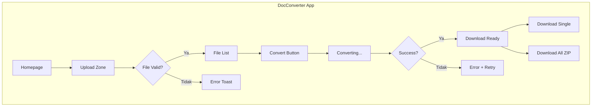
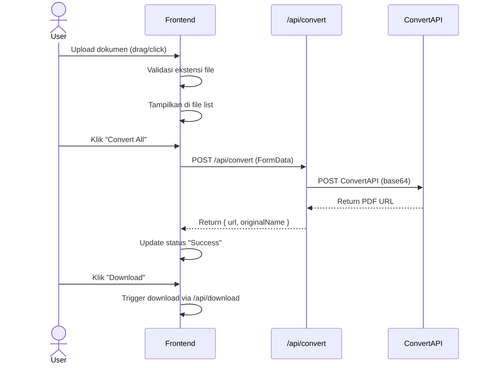

# DocConverter - Wireframe & Arsitektur Navigasi

Dokumentasi wireframe dan alur navigasi aplikasi DocConverter.

---

## 🗺️ Arsitektur Navigasi



---

## 📱 Wireframe Layout

### Desktop Layout (> 768px)

```
┌─────────────────────────────────────────────────────────────┐
│  [Logo] DocConverter                      [Log In] [Sign Up]│
├─────────────────────────────────────────────────────────────┤
│                                                             │
│                    Document to PDF                          │
│           Fast, secure, and high-quality...                 │
│                                                             │
│  ┌─────────────────────────────────────────────────────┐   │
│  │                                                     │   │
│  │              [Cloud Icon]                           │   │
│  │         Click to upload documents                   │   │
│  │      or drag and drop files here                    │   │
│  │                                                     │   │
│  └─────────────────────────────────────────────────────┘   │
│                                                             │
│  ┌─────────────────────────────────────────────────────┐   │
│  │ [DOC] document.docx   2.5MB • Ready          [X]    │   │
│  └─────────────────────────────────────────────────────┘   │
│  ┌─────────────────────────────────────────────────────┐   │
│  │ [XLS] data.xlsx       1.2MB • Converting... 45%     │   │
│  │ [=========>                                    ]    │   │
│  └─────────────────────────────────────────────────────┘   │
│                                                             │
│            [Download All]    [Convert All to PDF →]        │
│                                                             │
├─────────────────────────────────────────────────────────────┤
│  © 2026 Kelompok 4 TI        Privacy | Terms | Contact      │
└─────────────────────────────────────────────────────────────┘
```

### Mobile Layout (< 480px)

```
┌──────────────────────────┐
│ [Logo] DocConverter      │
│              [Login][Up] │
├──────────────────────────┤
│                          │
│    Document to PDF       │
│   Fast, secure, and...   │
│                          │
│ ┌──────────────────────┐ │
│ │    [Cloud Icon]      │ │
│ │  Click to upload     │ │
│ │  or drag and drop    │ │
│ └──────────────────────┘ │
│                          │
│ ┌──────────────────────┐ │
│ │[DOC] doc.docx   [X]  │ │
│ │      1.2MB • Ready   │ │
│ └──────────────────────┘ │
│                          │
│ ┌──────────────────────┐ │
│ │   [Download All]     │ │
│ └──────────────────────┘ │
│ ┌──────────────────────┐ │
│ │ [Convert All to PDF] │ │
│ └──────────────────────┘ │
│                          │
├──────────────────────────┤
│  © 2026 Kelompok 4 TI    │
│  Privacy | Terms | Contact│
└──────────────────────────┘
```

---

## 🔄 User Flow



---

## 📐 Halaman Struktur

| Halaman | Route | Deskripsi |
|---------|-------|-----------|
| Homepage | `/` | Halaman utama dengan upload dan konversi |

### Komponen Utama

1. **Header** - Logo + Auth buttons
2. **Hero Section** - Title + subtitle
3. **Upload Card** - Drop zone + file list + actions
4. **Footer** - Copyright + links

---

## 🎯 Status File

| Status | Visual | Aksi |
|--------|--------|------|
| Ready | Gray dot | Remove, Convert |
| Converting | Blue pulse + progress bar | - |
| Success | Green checkmark | Download, Remove |
| Error | Red X | Retry, Remove |

---

*Dokumentasi ini dibuat untuk proyek tugas Kelompok 4 TI - DocConverter*
